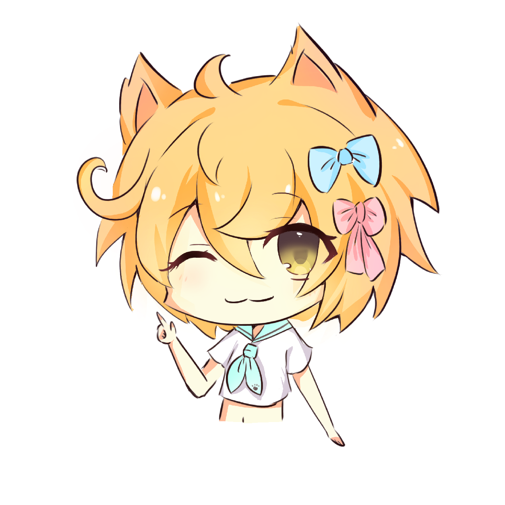
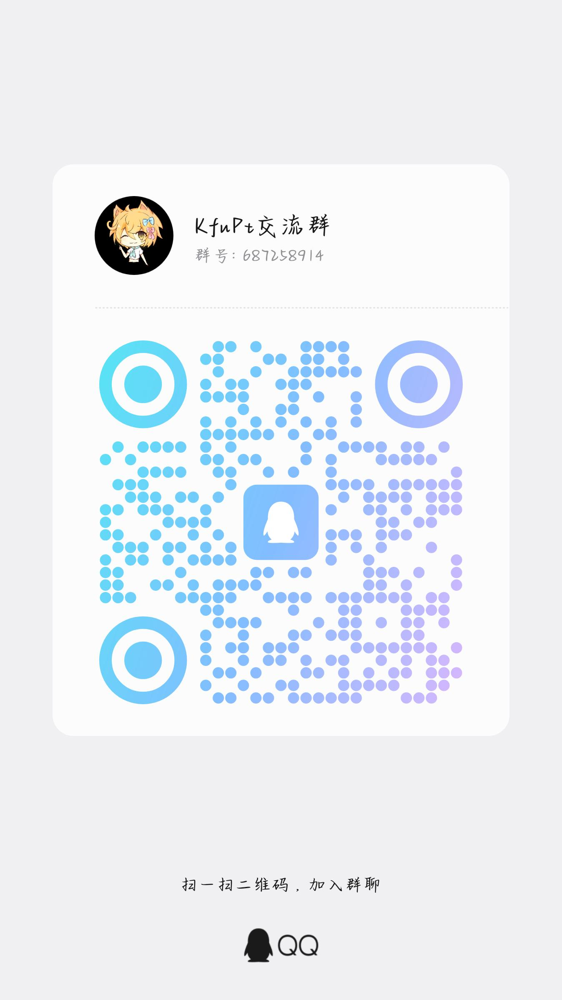
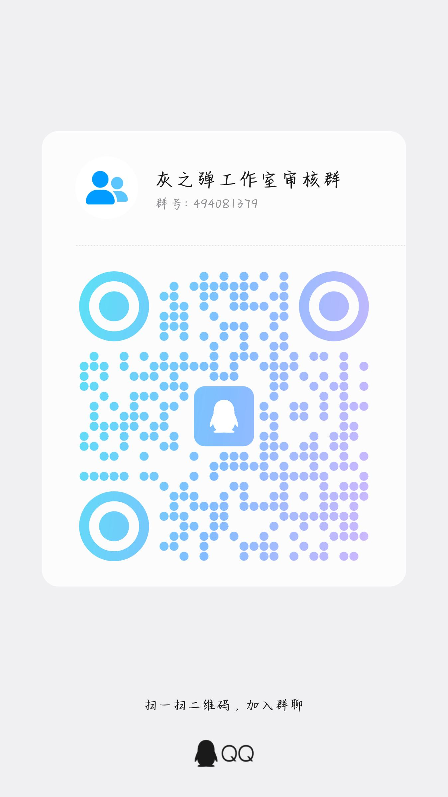

<h2> Kfu Pet </h2>

 你的智能桌面伙伴 

<h3><s>AI桌宠</s>≠智能生命体</h3>
 

## 说明

> [!IMPORTANT]
>
> ### 关于本项目
>
> - 本项目 **KfuPet** 是一款基于 **WinUI** 开发的桌面宠物应用
> - 采用 **混合动作系统**，结合本地预设动画与 AI 实时驱动，实现低成本、高性能且富有创意的角色交互表现
> - 本项目采用 **AGPL-3.0** 协议 + 自定协议进行开源

欢迎各位大佬 `Star` 😍

 

## 💻 更新记录

### v0.0.1版本待发布

 

## 🍪 关于画饼

### 项目正在积极开发中，敬请期待 🚀
### 详细架构设计文档：[点击查看](docs/ARCHITECTURE.md)

 

## 🧑‍💻 开发

- 本项目采用 **C#** + **WinUI** 开发（基于 "WinUI 空白应用（已打包）" 模板）
- Windows SDK 版本要求：>= 10.0.22621.0

### 快速开始

1. 使用 Visual Studio 打开项目
2. 还原 NuGet 依赖
3. 启动调试：`F5`
4. 构建：右键项目 → 生成

 

## 😍加入我们

<table align="center">
  <tr>
    <td align="center">
      
       
      欢迎加入讨论
    </td>
    <td align="center">
      
       
      欢迎加入我们
    </td>
  </tr>
</table>

## 😘鸣谢

- [xiao-Kfu](https://github.com/xiao-Kfu) 图片模型提供
- 等。。。

## 📜 开源许可

- **本项目仅供个人学习研究使用，禁止用于商业及非法用途**
- 本项目基于 [GNU Affero General Public License (AGPL-3.0)](https://www.gnu.org/licenses/agpl-3.0.html) + [自定协议进行开源](LICENSE.addendum)
  1. **修改和分发：** 任何对本项目的修改和分发都必须基于 AGPL-3.0 和 自定协议 进行，源代码必须一并提供
  2. **网络服务：** 如果本项目的代码被用于提供网络服务，服务的用户必须能够获取完整的源代码
  3. **派生作品：** 任何派生作品必须同样采用 AGPL-3.0 和 自定协议，并在适当的地方注明原始项目的许可证
  4. **免责声明：** 根据 AGPL-3.0 和 自定协议，本项目不提供任何明示或暗示的担保
  5. **社区参与：** 欢迎社区的参与和贡献，我们鼓励开发者一同改进和维护本项目
  6. **关于协议：** This project is licensed under the GNU AGPLv3.All redistribution and derivative works are subject to both LICENSE and LICENSE.addendum.LICENSE.addendum is an inseparable supplementary term pursuant to AGPLv3 Section 7, with equal legal force.Any distribution without LICENSE.addendum constitutes a license violation.

 

## Star History

<a href="https://www.star-history.com/?repos=Lrht-llw%2FKfuPet&type=timeline&logscale=&legend=bottom-right">
 <picture>
   <source media="(prefers-color-scheme: dark)" srcset="https://api.star-history.com/chart?repos=Lrht-llw/KfuPet&type=timeline&theme=dark&logscale&legend=bottom-right" />
   <source media="(prefers-color-scheme: light)" srcset="https://api.star-history.com/chart?repos=Lrht-llw/KfuPet&type=timeline&logscale&legend=bottom-right" />
   
 </picture>
</a>
